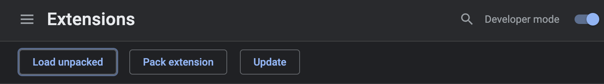
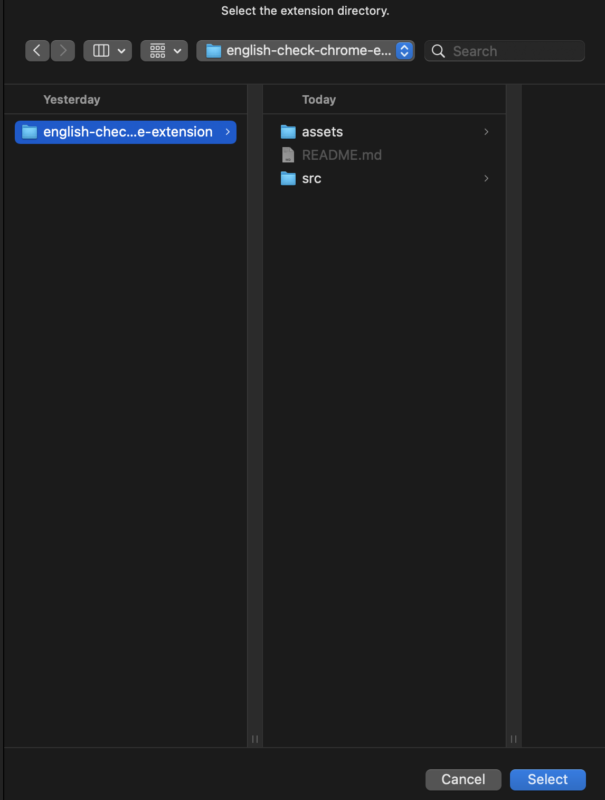
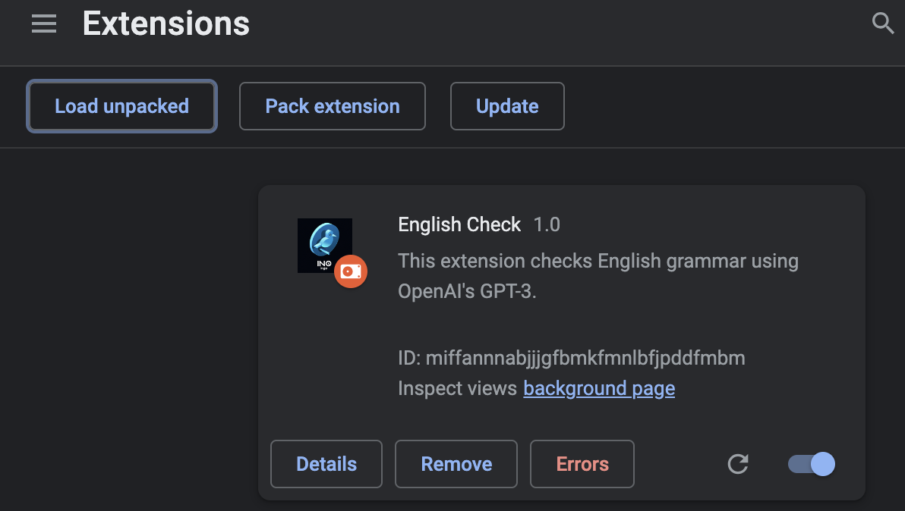
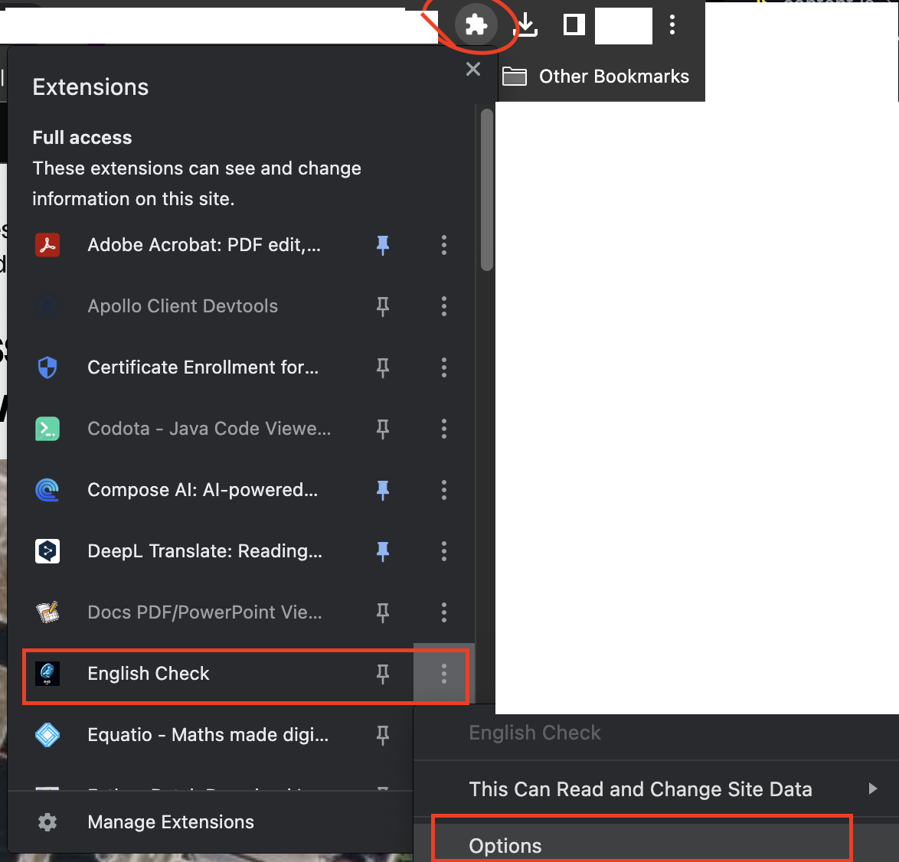

🐦 ingo: A Chrome `English Check` extension powered by ChatGPT
===

 

    

 

## What is this?

- Select English text on the page.
- Execute it from the context menu.
- It corrects the selected text in English and displays it in a pop-up.

## How to use

- `git clone https://github.com/XinyueZ/english-check-chrome-extension.git`
- Open page: `chrome://extensions/`
    - 
- Enable `Developer mode` (top right)  and `load unpacked` (top left)
    - 
    - `root/src`
        - 
- After installation, you see like this
    - 
- Enter the API key of [OpenAI]:
    - 
    - 

## License (Apache-2.0)

[LICENSE](./LICENSE) 